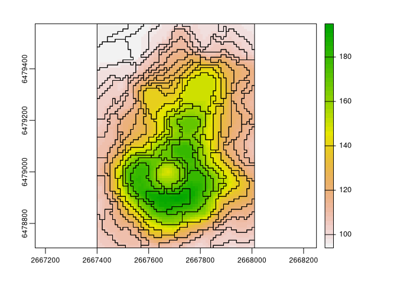
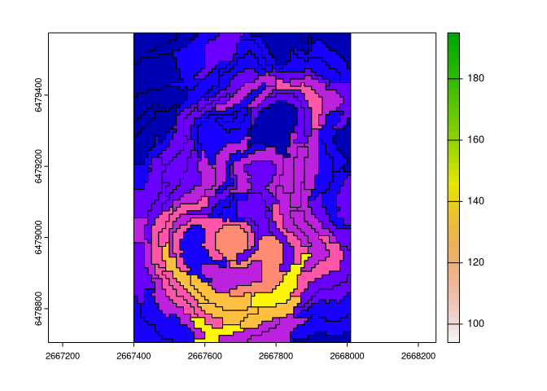
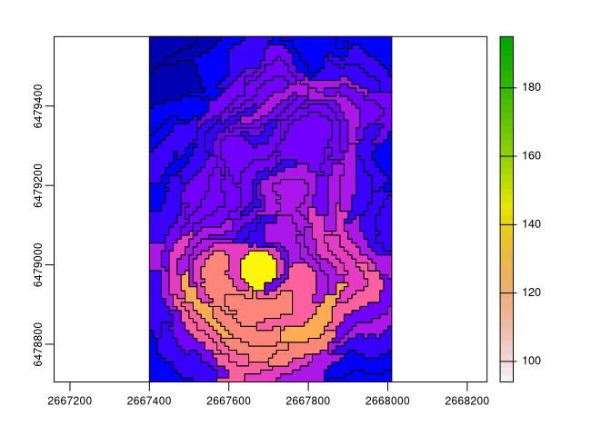

<!-- README.md is generated from README.Rmd. Please edit that file -->

# regional

<!-- badges: start -->

[](https://CRAN.R-project.org/package=regional)
[](https://github.com/Nowosad/regional/actions)
[](https://app.codecov.io/gh/Nowosad/regional?branch=master)
[](https://cran.r-project.org/package=regional)
<!-- badges: end -->

The **regional** package calculates intra-regional and inter-regional
similarities based on user-provided spatial vector objects (regions) and
spatial raster objects (cells with values). Implemented metrics include
inhomogeneity, isolation (Haralick and Shapiro (1985),
<https://doi.org/10.1016/S0734-189X(85)90153-7>\>, Jasiewicz et
al. (2018), <https://doi.org/10.1016/j.cageo.2018.06.003>), and
distinction (Nowosad (2021),
<https://doi.org/10.1080/13658816.2021.1893324>).

## Installation

You can install the released version of regional from
[CRAN](https://CRAN.R-project.org) with:

``` r
install.packages("regional")
```

You can install the development version from
[GitHub](https://github.com/) with:

``` r
# install.packages("remotes")
remotes::install_github("Nowosad/regional")
```

## Example

``` r
library(regional)
library(terra)
library(sf)
volcano = rast(system.file("raster/volcano.tif", package = "regional"))
vr = read_sf(system.file("regions/volcano_regions.gpkg", package = "regional"))
plot(volcano)
plot(vect(vr), add = TRUE)
```



### Inhomogeneity

How much internally inconsistent each region is?

``` r
vr$inh = reg_inhomogeneity(vr, volcano, sample_size = 0.5)
plot(volcano)
plot(vr["inh"], add = TRUE)
```



``` r
mean(vr$inh)
#> [1] 2.746237
```

### Isolation

How much the focus region differs from its neighbors?

``` r
vr$iso = reg_isolation(vr, volcano, sample_size = 1)
plot(volcano)
plot(vr["iso"], add = TRUE)
```



``` r
mean(vr$iso)
#> [1] 7.747211
```

## Contribution

Contributions to this package are welcome - let me know if you need
other distance measures or transformations, have any suggestions, or
spotted a bug. The preferred method of contribution is through a GitHub
pull request. Feel also free to contact us by creating [an
issue](https://github.com/nowosad/regional/issues).
